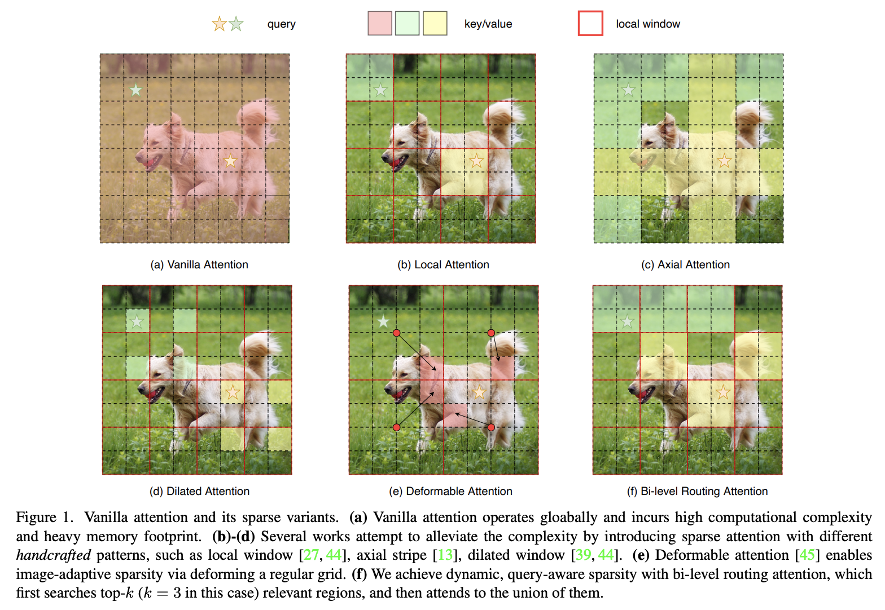

# [Hypergraph BiFormer for Semantic Segmentation of High-Resolution Remote Sensing Images]

Official PyTorch implementation of **BiFormer**, from the following paper:

[BiFormer: Vision Transformer with Bi-Level Routing Attention](https://arxiv.org/abs/2303.08810). CVPR 2023.\
[Lei Zhu](https://github.com/rayleizhu), [Xinjiang Wang](https://www.linkedin.com/in/wang-xinjiang-784a3462), [Zhanghan Ke](https://zhke.io/), [Wayne Zhang](http://www.statfe.com/), and [Rynson Lau](https://www.cs.cityu.edu.hk/~rynson/)

--- 
<p align="left">

</p>

<!-- ✅ ⬜️  -->

## Installation
Please install conda env and requirments for installation. 
```
pip install dhg
```
```
pip install -r requirments
```


## Training
```
bash dis_train.sh
```