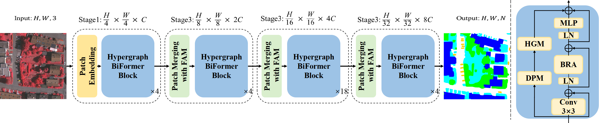
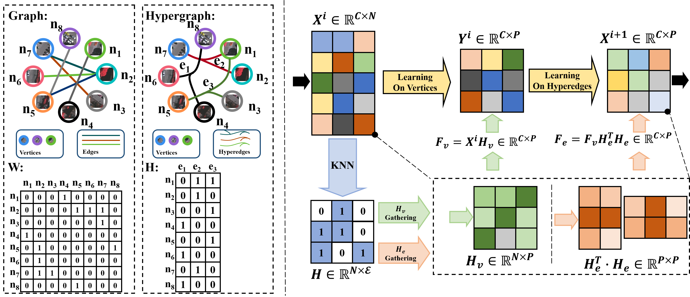

# [Hypergraph BiFormer for Semantic Segmentation of High-Resolution Remote Sensing Images]

Official PyTorch implementation of **Hypergraph BiFormer**




## Installation
Please install conda env and requirments for installation. 
```
pip install dhg
```
```
pip install -r requirments
```


## Training
```
bash dis_train.sh
```