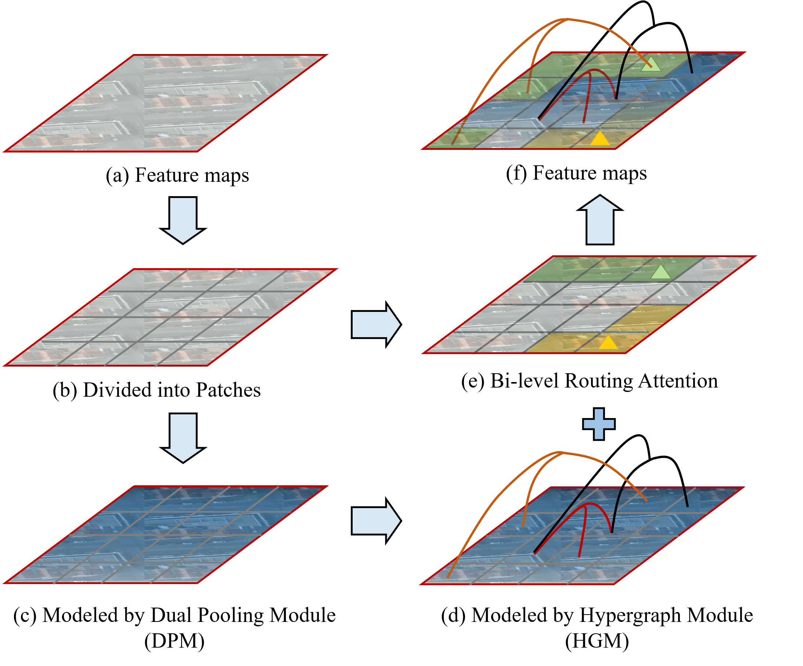
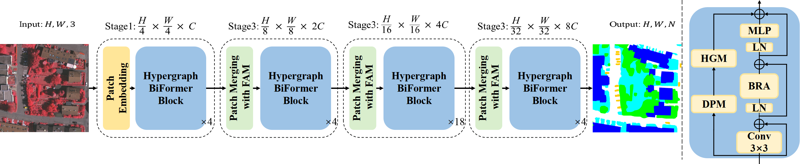
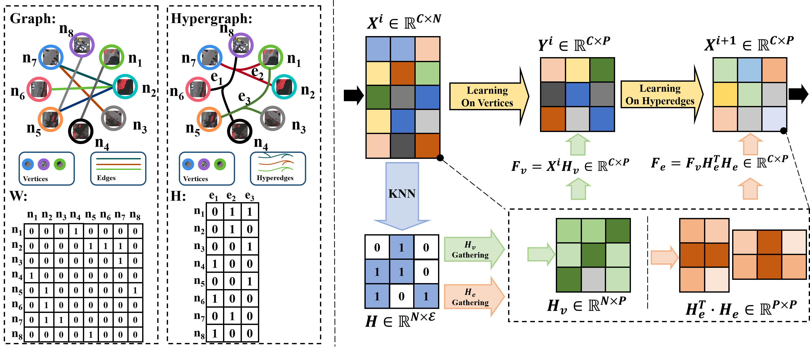

<br>
<p align="center">
<h1 align="center"><strong>Hypergraph BiFormer for Semantic Segmentation of High-Resolution Remote Sensing Images (TGRS 2025)</strong></h1>
  <p align="center">
    <a href='https://orcid.org/0000-0001-7933-6946' target='_blank'>Weipeng Jing<sup>1</sup></a>&emsp;
    <a href='https://orcid.org/0000-0002-3162-0259' target='_blank'>Wenjun Zhang<sup>1</sup></a>&emsp;
    <a href='https://ieeexplore.ieee.org/author/37087112310' target='_blank'>Donglin Di<sup>2</sup></a>&emsp;
    <a href='https://orcid.org/0000-0003-1932-7698' target='_blank'>Chao Li<sup>1*</sup></a>&emsp;
    <a href='https://orcid.org/0000-0002-1290-4272' target='_blank'>Mahmoud Emam<sup>3</sup></a>&emsp;
    <a href='https://orcid.org/0000-0002-5206-3842' target='_blank'>Ajmal Mian<sup>4</sup></a>&emsp;
    <br>
    <sup>1</sup>Northeast Forestry University&emsp;<sup>2</sup>Li. Auto&emsp;<sup>3</sup>Menoufia University&emsp;<sup>4</sup>West Australia University
  </p>
</p>

[Paper Link](https://ieeexplore.ieee.org/abstract/document/10906377)

--- 
<p align="center">

</p>

---
## Abstract
<p align="justify">
While transformers are powerful neural network architectures for feature learning, current Transformer-based approaches for semantic segmentation of high-resolution remote sensing images (HRRSIs) struggle with the extraction of local semantic features. To address this issue, we incorporate a hypergraph into the Transformer. Hypergraph-based methods are proficient at discovering high-order correlations within limited-scale data, extracting pertinent representations to enhance the Transformer’s learning capabilities. We also propose dual pooling and feature aggregation modules (FAMs), inspired by the adaptive pooling’s potent local modeling capabilities, to additionally extract fine-grained features from HRRSIs. In particular, we conceive a hypergraph BiFormer (HGBT) based on these three proposed modules along with a BiFormer backbone. HGBT has the potential to learn general latent features as well as generate high-order representations of HRRSIs by modeling correlations of multiscale features and local topology within an entirely nonlinear space, leading to the aggregation of features in a compact and localized manner, enhancing the model’s ability to capture detailed variations within small areas. We validate our approach through extensive experiments on ISPRS Vaihingen and Potsdam datasets, where HGBT attains mean intersection over union (mIoU) of 83.71% and 87.88%, respectively. Both quantitative and qualitative assessments underscore the dominance of HGBT.
</p>

--------------------------------------------------------------------------------
## Overview




## Installation
#### Environment Setup
Please install conda env and requirments for installation. 

```bash
conda env create -f environment.yaml
conda activate hgbformer
```

#### Dataset Preparetion

1. Download the [ISPRS]([http://](https://www.isprs.org/resources/datasets/benchmarks/UrbanSemLab/semantic-labeling.aspx)) Remote Sensing dataset and structure the data as follows:

```bash
/path/to/potsdam/
  ann_dir/
    train/
      img1.png
    val/
      img2.png
  img_dir/
    train/
      img1.png
    val/
      img2.png
```

2. Create the soft link to the ISPRS path
```bash 
mkdir data
ln -s /path/to/potsdam data/potsdam
```

> Note: Vaihingen dataset should be processed the same way as the Potsdam dataset.

#### Dependencies
1. If the environment file fails to install mmcv automatically, please follow the official installation [instructions](https://github.com/open-mmlab/mmcv/tree/main) to install it manually.

1. Install [dhg](https://github.com/iMoonLab/DeepHypergraph) package for HGM
```
pip install dhg
```

3. Install [Adapooling](https://github.com/alexandrosstergiou/adaPool) and [Softpooling](https://github.com/alexandrosstergiou/SoftPool) for DPM and FAM

```bash
# Please follow the instructions in the original repository.
# Set up the two pooling functions in your workspace:
#   /your_workspace/HGBFormer/semantic_segmentation/models_mm

# Note: Due to differences in implementation versions, you may encounter errors.
# To fix this, replace the 'idea.py' file in the original repository with the provided version.

```


## Run
> Note: Please replace the corresponding paths in the config files and shell scripts with your own dataset paths. 
> The ${dataset_name} can be either potsdam or vaihingen 

```
cd semantic_segmentation
bash dis_${dataset_name}_train.sh
```

## Acknowledgement
This repository is built using the [BiFormer](https://github.com/rayleizhu/BiFormer) , [DeepHypergraph](https://github.com/iMoonLab/DeepHypergraph),  [AdaPooling](https://github.com/alexandrosstergiou/adaPool), [SoftPooling](https://github.com/alexandrosstergiou/SoftPool), and [mmcv](https://github.com/open-mmlab/mmcv) repositories.

## Citation
```
@article{jing2025hypergraph,
  title={Hypergraph biformer for semantic segmentation of high-resolution remote sensing images},
  author={Jing, Weipeng and Zhang, Wenjun and Di, Donglin and Li, Chao and Emam, Mahmoud and Mian, Ajmal},
  journal={IEEE Transactions on Geoscience and Remote Sensing},
  year={2025},
  publisher={IEEE}
}
```

## License
This project is released under the MIT license. Please see the [LICENSE](LICENSE) file for more information.